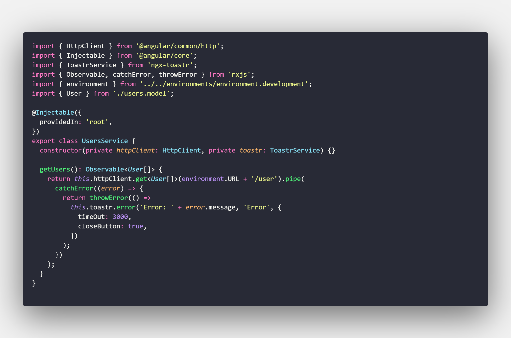
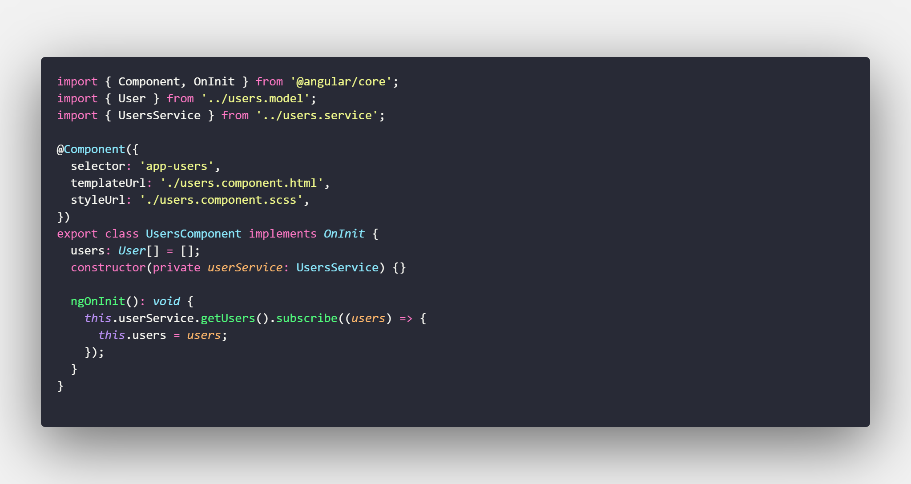
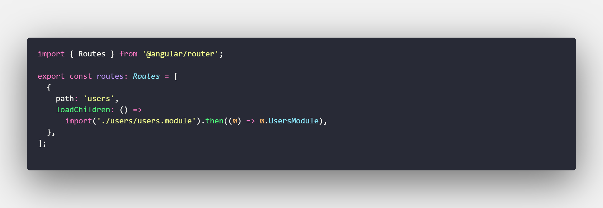
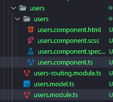
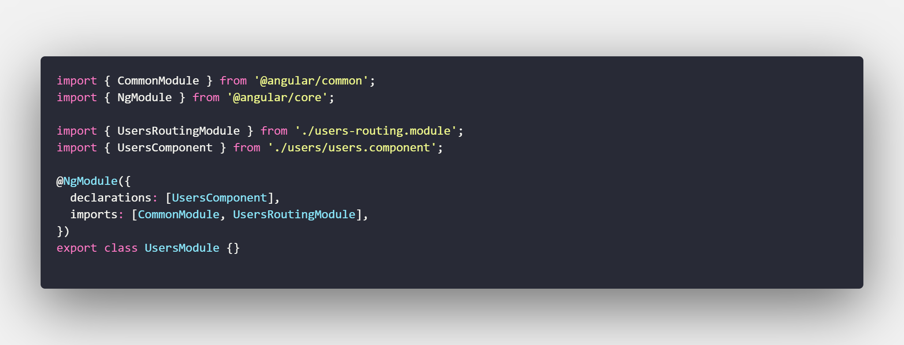
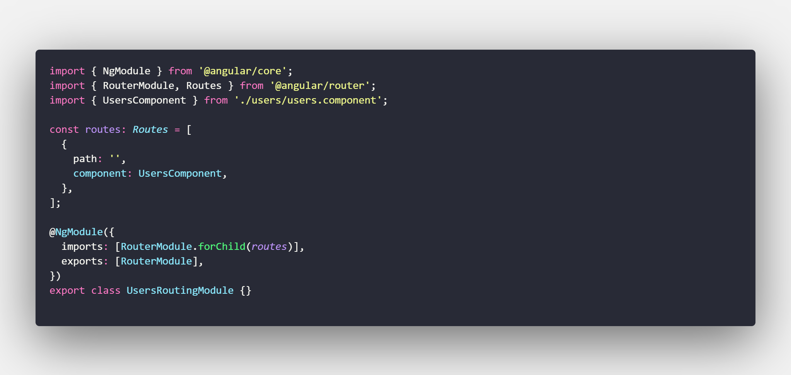
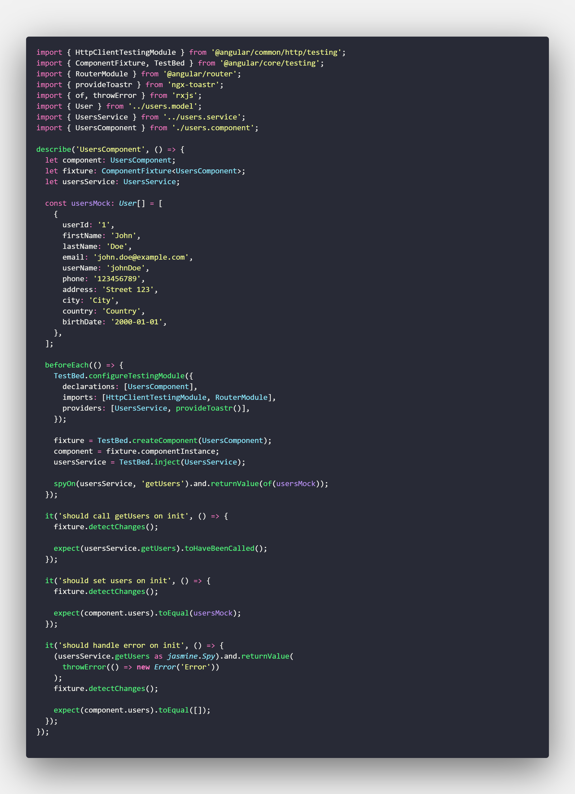

# NTTData Technical Assessment

This project was generated with [Angular CLI](https://github.com/angular/angular-cli) version 17.0.1.

## Development server

Run `ng serve` for a dev server. Navigate to `http://localhost:4200/`. The application will automatically reload if you change any of the source files.

## Code scaffolding

Run `ng generate component component-name` to generate a new component. You can also use `ng generate directive|pipe|service|class|guard|interface|enum|module`.

## Build

Run `ng build` to build the project. The build artifacts will be stored in the `dist/` directory.

## Running unit tests

Run `ng test` to execute the unit tests via [Karma](https://karma-runner.github.io).

## Running end-to-end tests

Run `ng e2e` to execute the end-to-end tests via a platform of your choice. To use this command, you need to first add a package that implements end-to-end testing capabilities.

## Further help

To get more help on the Angular CLI use `ng help` or go check out the [Angular CLI Overview and Command Reference](https://angular.io/cli) page.

# Manejo de Datos Asíncronos con RxJS
- Supongamos que estás desarrollando una aplicación Angular que
necesita obtener datos de un servicio RESTful. Utiliza RxJS para realizar
una llamada HTTP a un endpoint simulado, transforma la respuesta
para extraer solo la información necesaria y muestra los datos en un
componente. Asegúrate de manejar cualquier posible error en la
llamada HTTP.

# Mejoras en la Navegación

# Estrategias Prácticas de Optimización

1. Lazy Loading y Precarga de Módulos
  - Lazy Loading: Carga de módulos bajo demanda.
  Esto es importante ya que no todos los usuarios van a necesitar todos los módulos de la aplicación, por lo que no tiene sentido cargarlos todos al inicio. Ademas que esto puede afectar el rendimiento de la aplicación.
2. Uso de ChangeDetectionStrategy.OnPush
  - Esto es importante ya que Angular por defecto utiliza la estrategia de detección de cambio
  ChangeDetectionStrategy.Default, la cual es muy costosa, ya que cada vez que se realiza un cambio en la aplicación, Angular realiza una revisión de todos los componentes de la aplicación, lo cual puede afectar el rendimiento de la aplicación.
  ChangeDetectionStrategy.OnPush, solo realiza la revisión de los componentes que tienen un cambio en sus propiedades de entrada, lo cual mejora el rendimiento de la aplicación.
3. Uso del Pipe Async o desuscripción manual
  - Esto es importante ya que las suscripciones a observables pueden generar problemas de memoria, ya que si no se desuscriben manualmente, pueden quedar en memoria (memory leaks) y generar problemas de rendimiento.

# Pruebas Unitarias para un Escenario Real
Este es un ejemplo de un componente que realiza una llamada a un servicio para obtener los datos de los usuarios y los muestra en una tabla.

